# SpaceFight

| Name          | Student ID    | Class   |
| ------------- |:-------------:| -------:|
| Daniel Simons | C17371946     | DT228/4 |

# Youtube videos
|Youtube short movie| Youtube demo of different behaviours|
|-------------------|:------------------------------------|
|[](https://youtu.be/tpjLCBHfik8)|[](https://youtu.be/K37bPsGTnXQ)|


# Description of States
There is a total of 9 states implemented.

## Pursue behaviour (Behaviour used from course)
[Pursue behaviour](./WW2V2/Assets/Scripts/PursueBehaviour.cs)

Pursue behaviour occurs when the target is within the detection range and that the ship has ammo. If the ship is ship not within the detection range but not within the shooting range the enemy ship must be within the fov of the ship 
This class uses the method "SeekForce" to go towards the position of the target

## Attack behaviour
[Attack behaviour](./WW2V2/Assets/Scripts/AttackBehaviour.cs)

Attack behaviour is when the ship targets another ship and begins to fire at the ship, the target ship must be within shooting range and the FOV of the ship.
This is very similar to the pursue behaviour apart from two key differences, this behaviour uses two coroutines, one to shoot and the other to reload. These coroutines are started when the script is enabled. 
The shoot method instantiates a bullet using a bullet prefab defined in the ShipSystems class, a bullet is created for each gun on the plane. The plane only shoots when it has ammo and when the target is within range and FOV. Each plane has limited ammo
Ammo is restored when the plane runs below 5 ammo, it takes 10 seconds to recharge the ammo using the WaitForSeconds method 
```cs 
//Shooting method 
    public void shoot()
    {
        shipInfo.shootFX.Play();
        Vector3 distanceToEnemy = shipInfo.targetEnemy.transform.position - shipInfo.transform.position;
        if(Vector3.Angle(shipInfo.transform.forward, distanceToEnemy) < 45 && distanceToEnemy.magnitude <= shipInfo.shootingRange)
        {
            if(shipInfo.ammo > 0)
            {
                GameObject bullet1 = GameObject.Instantiate(shipInfo.bulletPrefab, shipInfo.primaryTurrets.transform.GetChild(0).gameObject.transform.position,   shipInfo.transform.rotation);
                GameObject bullet2 = GameObject.Instantiate(shipInfo.bulletPrefab, shipInfo.primaryTurrets.transform.GetChild(1).gameObject.transform.position, shipInfo.transform.rotation);
                shipInfo.ammo --;
            }
        }
    }

    //Coroutine for shooting
    IEnumerator shootingCoroutine()
    {
        shoot();
        yield return new WaitForSeconds(1f);
    }

    //Coroutine for reloading
    IEnumerator reload()
    {

        if(shipInfo.ammo <= 5)
        {
            yield return new WaitForSeconds(10f);
            shipInfo.ammo = shipInfo.maxAmmo;
        }
        yield return new WaitForSeconds(0.1f);
    }
```

## Flee behaviour (Behaviour from course)
[Flee behaviour](./WW2V2/Assets/Scripts/FleeBehaviour.cs)

Flee behaviour occurs if the ship has no ammo and is within visibility range of the ship but not within the shooting range of the ship. This uses a very simple line of code to just go the opposite direction of the enemy. This behaviour also changes the speed to be slightly quicker so that the fleeing is more successful, this value is then returned to normal when the behaviour is disabled. 

## Swerve behaviour
[Swerve behaviour](./WW2V2/Assets/Scripts/SwerveBehaviour.cs)

Swerve behaviour occurs when the target is too close to the ship, depending on if the ship is osur or jibinis the behaviour reacts differently. If the target goes to close the enemy the distance between the target and the ship is recorded. This distance is then used to create a circle around  the ship. The circle is only ¼ complete for the ostur ships giving them a leading advantage to attack the ship again. These points are recorded and stored in an arraylist, then each point is cycled through until the ship has reached the end of its maneuver.  
```cs 
    public void getSwervePointsJibins()
    {
        int startIndex = Mathf.RoundToInt(radius/4);
        int finishIndex = Mathf.RoundToInt(radius/2);
        for(int i = startIndex; i < finishIndex; i++)
        {
            Vector3 pos = new Vector3(Mathf.Sin(theta * i) * (enemyTarget.transform.position.x + (enemyTarget.transform.forward.x * radius)), enemyTarget.transform.position.y + (enemyTarget.transform.forward.y * radius), Mathf.Cos(theta * i) * (enemyTarget.transform.position.z + (enemyTarget.transform.forward.z * radius)));
            swervePoints.Add(pos);
        }
    }

    public void  getSwervePointsOstur()
    {
        int startIndex = Mathf.RoundToInt(radius);
        int finishIndex = Mathf.RoundToInt(radius - (radius/3));

        for(int i = startIndex; i > finishIndex; i--)
        {
            Vector3 pos = new Vector3(Mathf.Sin(theta * i) * (enemyTarget.transform.position.x + (enemyTarget.transform.forward.x * radius)), enemyTarget.transform.position.y + (enemyTarget.transform.forward.y * radius), Mathf.Cos(theta * i) * (enemyTarget.transform.position.z + (enemyTarget.transform.forward.z * radius)));
            swervePoints.Add(pos);
        }
    }
```

## Combat avoidance behaviour
[Combat avoidance behaviour](./WW2V2/Assets/Scripts/CombatAvoidanceBehaviour.cs)

Combat avoidance occurs when the target ship is behind the ship, this behaviour makes the ship swerve up and down and side to side to avoid any laser fire from the target ship. This behaviour is adapted from the harmonic motion script. It uses a coroutine to cycle through different sine waves to avoid the enemy ship. When this occurs the speed is increased so that the ship has a chance to escape. 
```cs 
    public override Vector3 Calculate()
    {
        float n = Mathf.Sin(theta);
        float angle = n * amplitude * Mathf.Deg2Rad;
        Vector3 rot = transform.rotation.eulerAngles;    
        rot.x = 0;
        if (axis == Axis.Horizontal)
        {
            waveTarget.x = Mathf.Sin(angle);
            waveTarget.z = Mathf.Cos(angle);
            rot.z = 0;
        }
        else
        {
            waveTarget.y = Mathf.Sin(angle);
            waveTarget.z = Mathf.Cos(angle);
        }
        Vector3 localtarget = waveTarget + Vector3.forward * distance;
        globalTarget = transform.position + Quaternion.Euler(rot) * localtarget;

        theta += frequency * Time.deltaTime * Mathf.PI * 2.0f;

        return ship.SeekForce(globalTarget);
    }

    IEnumerator changeAxis()
    {
        while(true)
        {
            yield return new WaitForSeconds(5f);
            if(axis == Axis.Horizontal)
            {
                axis = Axis.Vertical;
            }
            else 
            {
                axis = Axis.Horizontal;
            }
        }
    }
```

## Obstacle avoidance behaviour (Behaviour from course)
[Obstacle avoidance behaviour](./WW2V2/Assets/Scripts/ObstacleAvoidanceBehaviour.cs)

This behaviour is always enabled so that the ship can avoid asteroids and other ships. There was no adaptation made to this script.

## Follow Path behaviour (Behaviour from course)
[Follow Path behaviour](./WW2V2/Assets/Scripts/FollowPathBehaviour.cs)

This is the default state of each ship, if there are no targets or the targets are outside the detection range of the ship then the ship pursues the next point on the path
There was no adaptation made to this script 

## Follow leader behaviour 
[Follow leader behaviour](./WW2V2/Assets/Scripts/FollowLeaderBehaviour.cs)

This is the default state of each ship (that is not a leader ship) ; this behaviour is an adapted version of the offset pursue behaviour. It implements both the regular pursue behaviour and the offset pursue behaviour. If the ship is outside the range of the offset it pursues the leader until it is close enough 
```cs 
    void Update()
    {
        distanceFromLeader = Vector3.Distance(ship.transform.position, leader.transform.position);
        if(distanceFromLeader < 10)
        {
            StartCoroutine(getOffsetValue());
        }
    }

    public override Vector3 Calculate()
    {
        if(distanceFromLeader < 10)
        {
            worldTarget = leader.transform.TransformPoint(offset);
            float dist = Vector3.Distance(transform.position, worldTarget);
            float time = dist / ship.maxSpeed;

            targetPosition = worldTarget + (leader.GetComponent<Ship>().velocity * time);
            return ship.ArriveForce(targetPosition);
        }
        else 
        {
            float dist = Vector3.Distance(leader.transform.position, transform.position);
            float time = dist / ship.maxSpeed;
            leaderPos = leader.transform.position;
            return ship.SeekForce(leaderPos);
        }
    }

    IEnumerator getOffsetValue()
    {
        offset = transform.position - leader.transform.position;
        offset = Quaternion.Inverse(leader.transform.rotation) * offset;
        yield return new WaitForEndOfFrame();
    }
```

## Death behaviour 
[Death behaviour](./WW2V2/Assets/Scripts/DeathBehaviour.cs)

Death behaviour is triggered when the ship has 0 health, the ship gradually speeds up and spins. It uses harmonic movement to go side to side while using a local rotation to spin it around on the z axis. This script has two coroutines that start when the script is enabled also a method is called which starts the particle system which displays smoke coming from the cockpit. During this time an audio source is played which makes the authentic sound of a world war 2 plane diving. After this audio clip is finished the play explodes with a particle system that displays an explosion. During this time the plane gameobject is destroyed. 
```cs 
 IEnumerator deathDive()
    {
        while(true) 
        {
            yield return new WaitForSeconds(0.3f);
            if(rotateSpeed < 1000)
            {
                rotateSpeed += 25f;
            }
        }
    }

    public void setTrailEffects()
    {
        GameObject trails = ship.transform.Find("Trails").gameObject;
        Destroy(trails.transform.GetChild(2).gameObject);
        Destroy(trails.transform.GetChild(0).gameObject);
        GameObject smokeGen = ship.transform.Find("SmokeGen").gameObject;
        smokeGen.transform.Find("Particle System").gameObject.GetComponent<ParticleSystem>().Play();
    }

    IEnumerator explosion()
    {
        shipInfo.deathSwoopFX.Play();
        yield return new WaitForSeconds(5f);
        explodeShip();
    }
    public void explodeShip()
    {
        GameObject explosion = ship.transform.Find("Explosion").gameObject.transform.Find("BigExplosion").gameObject;
        ParticleSystem explosionParticleSystem =  explosion.GetComponent<ParticleSystem>();
        float totalTime = explosionParticleSystem.main.duration - 1.5f;
        Destroy(ship.transform.gameObject, totalTime);
        shipInfo.explosion.Play();
        explosionParticleSystem.Play();
    }
```

___
# State machine explanation 

State             | Variables needed for state to be entered 
------------------|:-------------------------
Pursue            | +targetEnemy != null +ammo != 0 +targetEnemy.position within detectionRange
Attack            | +targetEnemy != null +ammo != 0 +targetEnemy within FOV
Flee              | +targetEnemy != null +ammo <= 0  +targetEnemy.position within detection range
Swerve            | +targetEnemy != null +targetEnemy.position within immediate range
Combat avoidance  | +targetEnemy != null +targetEnemy no within FOV
Obstacle avoidance| ENABLED BY DEFAULT
Follow Path       | +targetEnemy == null +isLeader
Follow leader     | +targetEnemy == null +isNotLeader
Death behaviour   | +health <= 0
___
# Description of Ship functionality
[Ship Systems](./WW2V2/Assets/Scripts/ShipSystems.cs)
[Spitfire](./WW2V2/Assets/Scripts/Spitfire.cs)
[Messerschmitt](./WW2V2/Assets/Scripts/Messerschmitt.cs)
[McCannon](./WW2V2/Assets/Scripts/McCannon.cs)

The ship functionality is broken down into 3 main parts, the state machine which was discussed previously which controls the behaviours of the ship, the ship class which controls the banking and steering behaviours of the ship (Boid) and then the ShipSystems class which controls the different attributes such as the health and ammo as well as the different coroutines such as the closest enemy and the leader of the group of ships. 
The ShipSystems script contains vital variables for the ships, such as the audio sound effects for the lasers, explosions and the swoop sound. It also has a gameobject for the bullet or in this case laser prefab that’s fired by each ship. 
Some key methods include the 3 coroutines which are the enemy detection, leader detection and path detection. Enemy detection locates the closest enemy to the ship if no enemy is selected using the enemy tagname variable. Each ship is assigned a tag and an enemy tag it's looking for which helps identify the enemy. 
The path detection identifies the path for the ship which is the name of the type of ship along with the path and finally the leader identification finds the first instance of the ship with the same tag. Finally there is a method to detect if a ship has collided with an enemy laser. Each laser has a tag associated with the ship type which ensures there is no friendly fire between ships of the same type. 
```cs
 public GameObject getClosestEnemy()
    {
        GameObject closestEnemy = null;
        float distance = Mathf.Infinity;
        GameObject[] enemies = GameObject.FindGameObjectsWithTag(enemyTag);
        Vector3 position = transform.position;
        foreach(GameObject enemy in enemies)
        {
            Vector3 diff = enemy.transform.position - position;
            float curDistance = diff.sqrMagnitude;
            if (curDistance < distance)
            {
                closestEnemy = enemy;
                distance = curDistance;
            }
        }
        return closestEnemy;
    }
    
       public IEnumerator enemyDetectionCoroutine()
    {
        while(true)
        {
            if(targetEnemy == null)
            {
                targetEnemy = getClosestEnemy();
            } 
            else 
            {
                float distanceFromCurrentEnemy = Vector3.Distance(transform.position, targetEnemy.transform.position);
                float distanceFromNearestEnemy = Vector3.Distance(transform.position, getClosestEnemy().transform.position);
                if(distanceFromCurrentEnemy > detectionRange)
                {
                    targetEnemy = getClosestEnemy();
                }
                if(distanceFromNearestEnemy < shootingRange && distanceFromCurrentEnemy > shootingRange)
                {
                    targetEnemy = getClosestEnemy();
                }
            }
            yield return new WaitForSeconds(2f);
        }
    }
```
```cs
    public GameObject getLeader()
    {
        GameObject leader = null;
        GameObject[] squad = GameObject.FindGameObjectsWithTag(transform.tag);
        leader = squad[squad.Length-1];
        if(leader == transform.gameObject)
        {
            squadLeader = true;
        }
        return leader;
    }
    public IEnumerator leaderDetectionCoroutine()
    {
        while(true)
        {
            if(targetLeader == null)
            {
                targetLeader = getLeader();
            }
            yield return new WaitForSeconds(0.1f);
        }
    }
```
```cs
    public Path getPath() 
    {
        if(transform.tag == "ostur")
        {
            GameObject osturRoute = GameObject.Find("OsturPath").gameObject;
            return osturRoute.GetComponent<Path>();
        }
        else if(transform.tag == "jibinis")
        {
            GameObject jibinisRoute = GameObject.Find("JibinisPath").gameObject;
            return jibinisRoute.GetComponent<Path>();
        }
        else 
        {
            return null;
        }
    }
        public IEnumerator pathDetectionCoroutine()
    {
        while(true)
        {
            if(path == null)
            {
                path = getPath();
            }
            yield return new WaitForSeconds(0.1f);
        }
    }
```
The classes McCannon, Spitfire and Messerschmitt all inherit the ShipSystems class, both Spitfire and Messershcmit utilize this class  without any changes while the McCannon uses this class but changes some of the methods as well as implement its own. McCannon has a number of other coroutines such as firing the cannons and exploding when its health starts to go low.  McCannon also has a number of extra audio clips such the charging of the cannons and firing the cannon.
```cs
IEnumerator fireCannons()
    {
        while(true) 
        {
            charge.Play();
            yield return new WaitForSeconds(4f);
            shootFX.Play();
            yield return new WaitForSeconds(0.5f);
            shoot();
            yield return new WaitForSeconds(6f);
        }
    }

    void explodeShip()
    {
        GameObject explosionObj = transform.Find("ExplosionMC").gameObject;
        int explosionCount = explosionObj.transform.childCount;
        for(int i = 0; i < explosionCount; i++)
        {
            if(!explosion.isPlaying)
            {
                explosion.Play();
            }
            explosionObj.transform.GetChild(i).gameObject.transform.Find("BigExplosion").GetComponent<ParticleSystem>().Play();
        }
        float totalTime = 4f;
        Destroy(gameObject, totalTime);
    }

    void shoot()
    {
        Instantiate(bulletPrefab, transform.Find("Cannons").gameObject.transform.GetChild(0).gameObject.transform.position, transform.rotation);
        Instantiate(bulletPrefab, transform.Find("Cannons").gameObject.transform.GetChild(1).gameObject.transform.position, transform.rotation);
        Instantiate(bulletPrefab, transform.Find("Cannons").gameObject.transform.GetChild(2).gameObject.transform.position, transform.rotation);
        Instantiate(bulletPrefab, transform.Find("Cannons").gameObject.transform.GetChild(3).gameObject.transform.position, transform.rotation);
    }
```


___
# Description of Asteroid functionality
[Asteroid Behaviour](./WW2V2/Assets/Scripts/AsteroidBehaviour.cs)
[Asteroid Belt Generation Behaviour](./WW2V2/Assets/Scripts/AsteroidBeltGeneration.cs)

The asteroid model was a free asset from the unity asset store. The asteroids are spawned in using a perlin noise algorithm to ensure some level of randomness with the asteroid positioning and a natural layout. The density of the asteroids can also be specified. Each asteroid is given a y coordinate from the perlin noise algorithm, the scale of the asteroid is also randomised with the use of the Mathf.clamp between a min and max value. The rotation speed and direction of the asteroid is also specified so that each asteroid has a unique appearance in game. When an asteroid comes into contact with a laser it will call the fracture method which spawns an asteroid of similar size but broken. This gives a nice effect in the game which shows asteroids breaking while the ships are in combat. 

```cs
    public void generateField()
    {
        float previousX = 0;
        float previousZ = 0;
        int asteroidIndex = 0;
        for(int row = -100; row < 600; row+= concentation)
        {
            for(int col = -100; col < 300; col+= concentation)
            {
                Vector3 asteroidPos = new Vector3(col, generatePerliNoise(previousX + row, previousZ + col), row);
                previousX+= 10;
                previousZ+= 10;
                asteroidIndex = Mathf.Abs(asteroidIndex) % asteroids.Length;
                GameObject asteroid = Instantiate(asteroids[asteroidIndex], asteroidPos, Quaternion.identity);
                float sizeIncrease = Mathf.Clamp(((Mathf.Abs(row) % 4) + asteroidIndex), minSize, maxSize);
                asteroid.transform.localScale = new Vector3(sizeIncrease, sizeIncrease, sizeIncrease);
                asteroid.transform.SetParent(transform);
                asteroid.GetComponent<AsteroidBehaviour>().rotatespeed = Mathf.RoundToInt(Mathf.Abs(col) * (asteroidIndex * 0.05f));  
                asteroid.GetComponent<AsteroidBehaviour>().rotationDirection = Mathf.RoundToInt((asteroidIndex + row) % 5);
                asteroidIndex++;
            }
        }
    }

    public float generatePerliNoise(float x, float y)
    {
        return (
        Mathf.PerlinNoise(10000 + x / 100, 10000 + y / 100) * 100)
        + (Mathf.PerlinNoise(10000 + x / 1000, 10000 + y / 1000) * 300)
        + (Mathf.PerlinNoise(1000 + x / 5, 100 + y / 5) * 2);
    }
```
```cs
    void fracture()
    {
        GameObject fracAsteroid = Instantiate(fracturedRock, transform.position, transform.rotation);
        Destroy(gameObject);
        Destroy(fracAsteroid, 5f);
    }

    void OnCollisionEnter(Collision collisionInfo)
    {
        if(collisionInfo.gameObject.tag == "ostur" ||
         collisionInfo.gameObject.tag == "jibinis" ||
         collisionInfo.gameObject.tag == "j_laser" ||
         collisionInfo.gameObject.tag == "o_laser")
        {
            fracture();
        }
    }
```
___
# Description of Camera functionality
[Camera Behaviour](./WW2V2/Assets/Scripts/CameraBehaviour.cs)
The camera functionality is controlled by the CameraBehaviour script, this script uses the lerp function to focus on the position of the ostur ship leader, if the leader dies the new leader is focused on. 
When the script starts the squad leader is retrieved, each ship has camera positions associated with it. These are the positions that the camera lerps to. 
If the ship is in a follow path behaviour it gives a side view of the ship while when the ship is attacking it focuses on the target that is attacking. This attack view from the camera gives a nice angle on the ship when it is taken damage. 
The follow path behaviour camera angle gives a different side angle of the ship depending on which waypoint the ship is on. Any other state the camera takes a third person view of the ship.
```cs
    IEnumerator changeCameraPosition() 
    {
        while(true)
        {

            if(ship.GetComponent<FollowPathBehaviour>().enabled == true)
            {
                int checkpoint = ship.GetComponent<FollowPathBehaviour>().path.next % 3;
                checkpoint = Mathf.Clamp(checkpoint, 1 , 2);
                target = shipCameraPos[checkpoint];
                targetFocus = ship.transform;
            } 
            else if(ship.GetComponent<AttackBehaviour>().enabled == true)
            {
                target = shipCameraPos[3];
                targetFocus = ship.GetComponent<ShipSystems>().targetEnemy.gameObject.transform;
            } 
            else 
            {
                target = shipCameraPos[0];
                targetFocus = ship.transform;
            }
            yield return new WaitForSeconds(2f);
        } 
    }
```


___
# Plot
This is a recreation of the battle of midway but is set in the future in an asteroid field.
The ostur forces (Good guys) are attempting a sneak attack on the unsuspsecting jibinis (Bad guys) and their new superweapon through an asteroid field.

___
# Models
The plane models are based on WW2 planes, such as the spitfire and the messerschmitt BF109
The large ship in these scene is based on a WW2 japanese battle ship. 
These three models were modelled using blender.
Trail renderers were used to simulate the engines of each of the planes, these can be seen in the video

___
### Spitfire V2
Model                      |  Blueprint
:-------------------------:|:-------------------------:
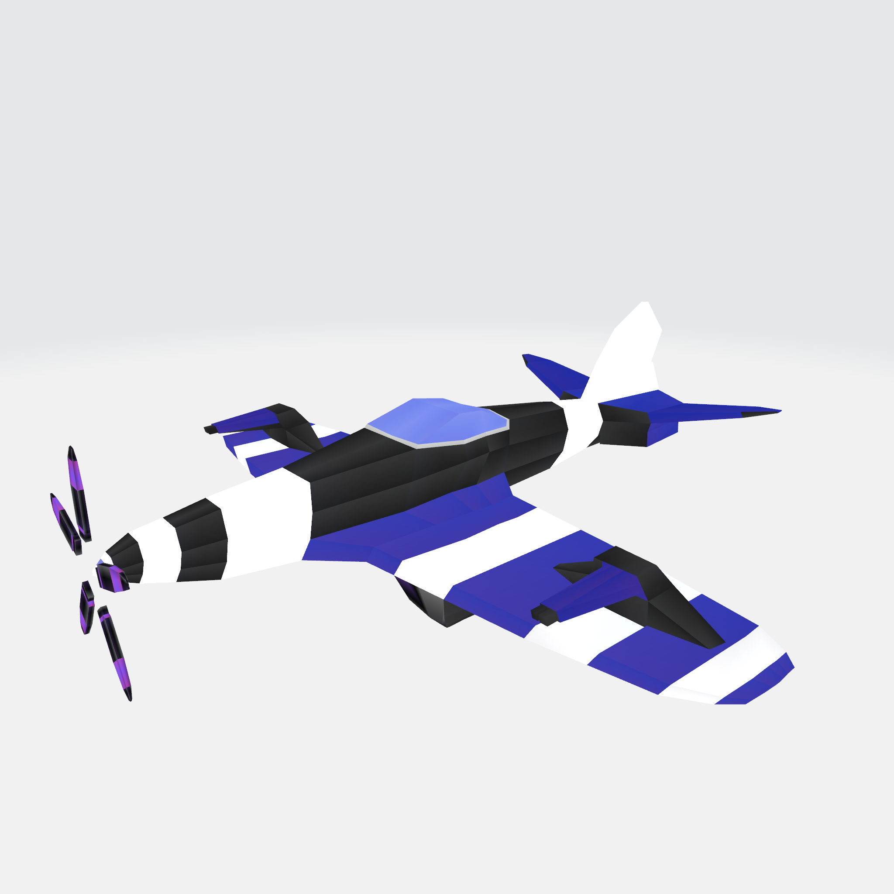  |  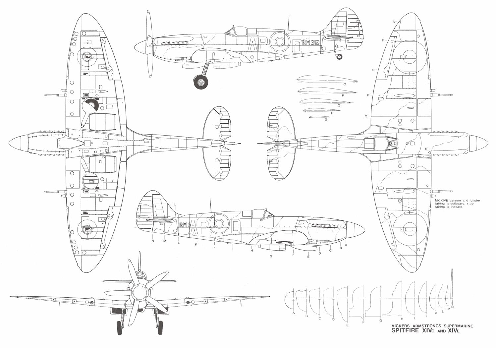 

___
### Messerschmitt V2
Model                      |  Blueprint
:-------------------------:|:-------------------------:
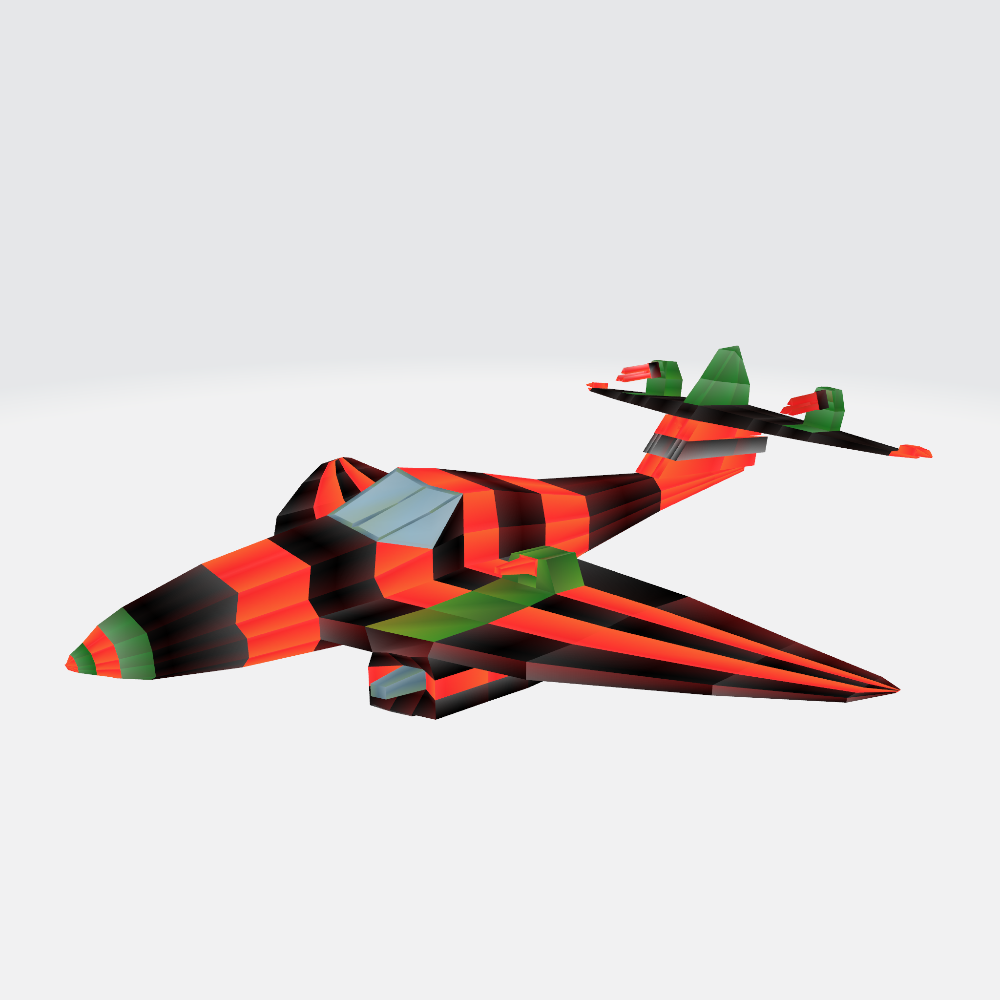  |  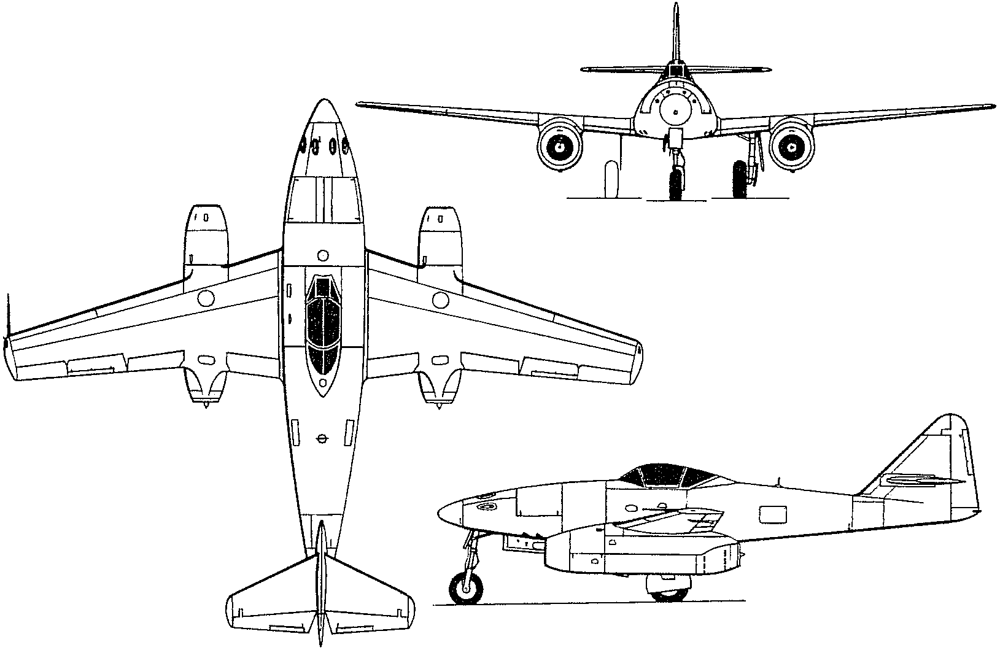 
___
### McCannon 
Model                      |  Blueprint
:-------------------------:|:-------------------------:
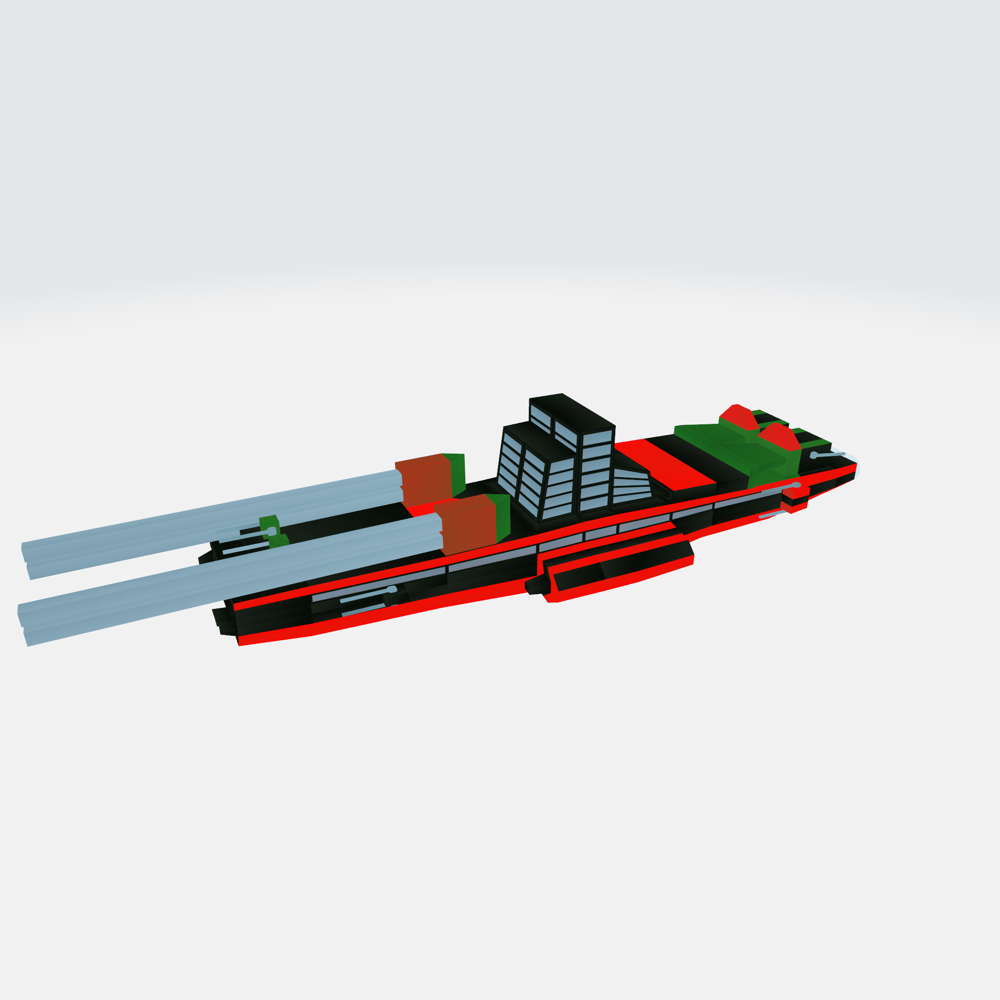  |  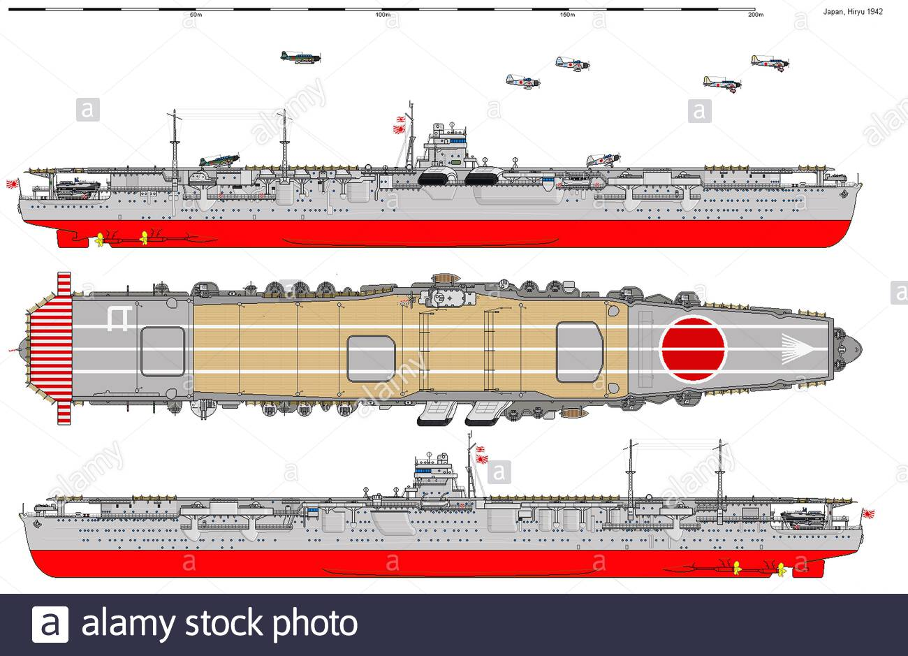 

___
# Story Board
Key :
| Plot          | Mechanics     | Camera  |
| ------------- |:-------------:| -------:|
| **P**         | **M**         | **C**   |

___
## Scene 1
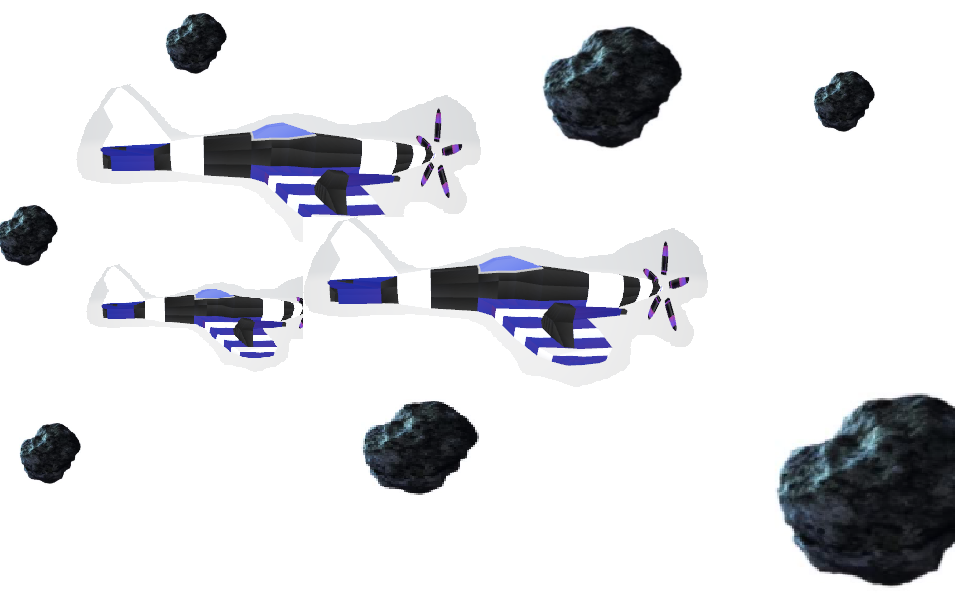

**P** : The scene opens with the ostur forces travelling through an asteroid field, swerving through asteroids.

**M** : Each plane will be using a path following behaviour and using object avoidance to swerve around the asteroids while maintaining a current path. Each plane will also bank when turning to simulate an actual plane turning. The propellar on the end of the ship slowly spins as the ship navigates through. 

**C** : The camera will maintain a side view of the planes going through the asteroid field.

___
## Scene 2
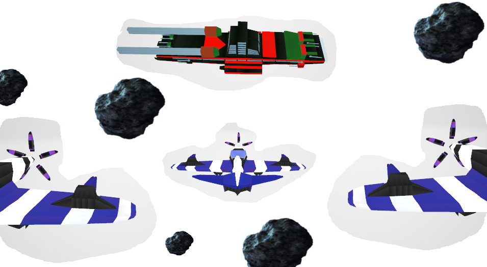

**P** : The ostur planes navigate to an opening in the density of the asteroids to which the McCannon enemy ship becomes visisible which is 100 times the size of each of the ostur ships.

**M** : Each plane will be using a path following behaviour and using object avoidance to swerve around the asteroids while maintaining a current path. Each plane will also bank when turning to simulate an actual plane turning. The propellar on the end of the ship slowly spins as the ship navigates through. 

**C** : The camera now mantains a view slightly behind the ships so that the McCannon ship is in sight.

___
## Scene 3 
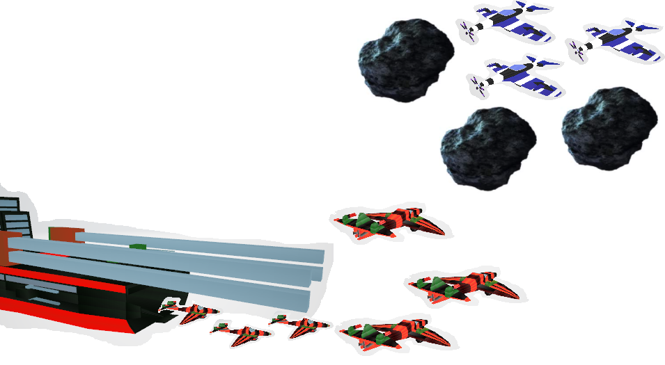

**P** : The enemy McCannon has been alerted to the ostur ships inbound, a siren is sounded and the release of enemy jibini ships.

**M** : The enemy ships act as a swarm behaviour and do not colide with each other and approach the asteroid field where the ostur ships are located.

**C** : The camera holds a view where the jibini ships are seen released from the hull of the ship and also can see the ostur ships in the distance asteroid field.

___
## Scene 4 
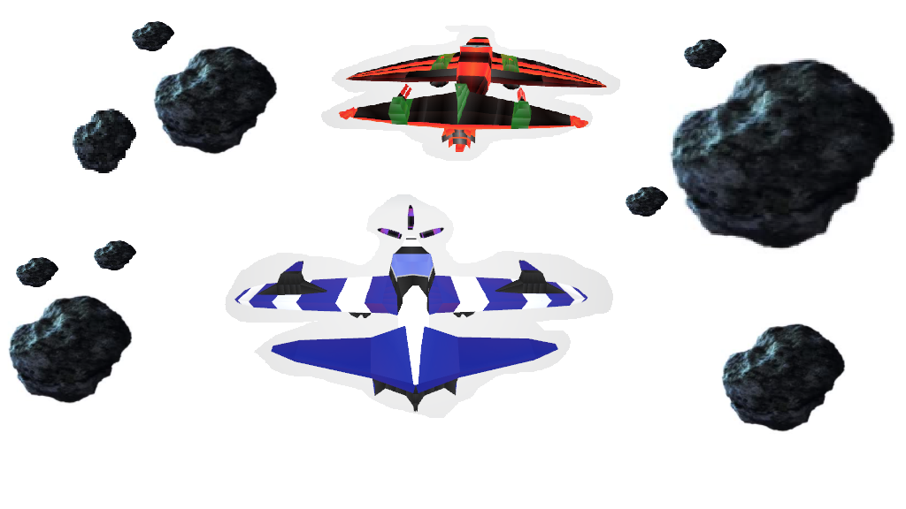

**P** : This scene follows one ostur ship swerving through the asteroid field chasing an enemy jibini ship, other ships can be seen crashing and shooting at each other.

**M** : Both the main ships in this scene use object avoidance to navigate through the asteroid field, while the ostur ship chases the enemy ship, they both exchange laser fire with finally the enemy ship destroyed.

**C** : The camera follows carefully a behind angle position on the ostur ship. 

___
## Scene 5
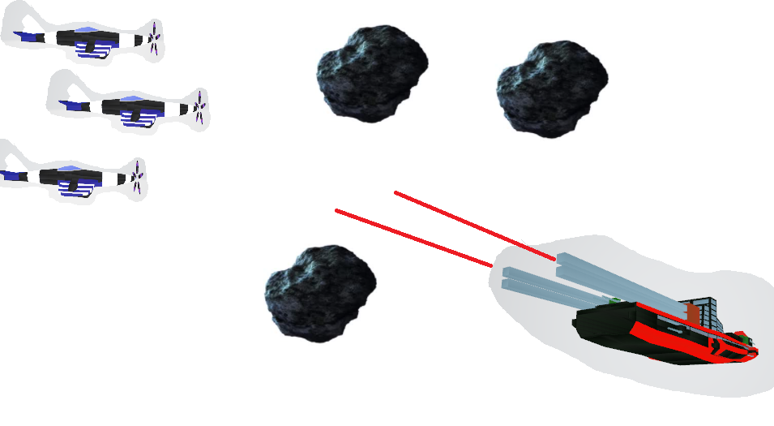

**P** : This scene captures the final descent onto the large McCannon ship where they hope to destroy it, the McCannon is facing them and charging up its weapon and firing at it.

**M** : The McCannon is firing large beams of laser towards the ships and the ships are trying to avoid it, the ostur ship are each charging up their ultimate weapon which spins the propellar even faster. The McCannon's side turrets are aimed and firing at the ships also.

**C** : The camera captures the whole battlefield and the ostur ships charging towards the McCannon while the McCannon fires at them.

___
## Scene 6
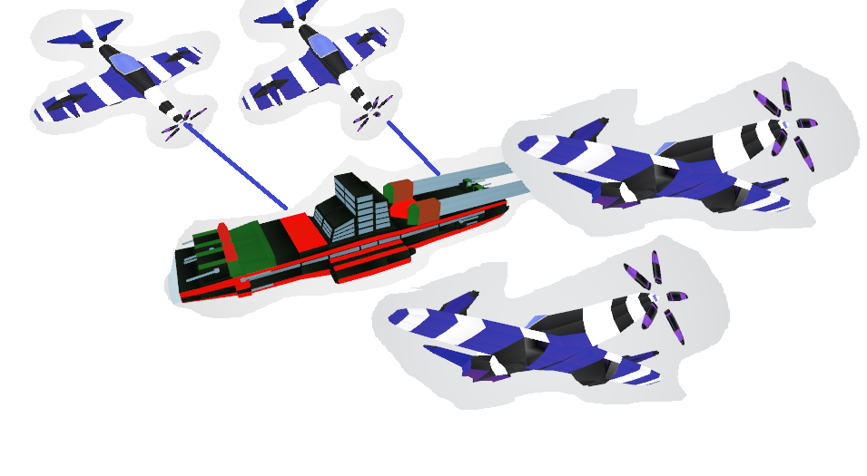

**P** : This scene shows the ostur ships firing their ultimate weapons at the engine of the ship and then swooping over it and flying away from it.

**M** : The propellar will shoot a beam from it which will be a thicker beam then regular laser fire in doing so the propellar will spin at max velocity.

**C** : The camera captures the scene just over the area where the McCannon ship is damaged, to capture the ostur ships swerving over it 

___
## Scene 7
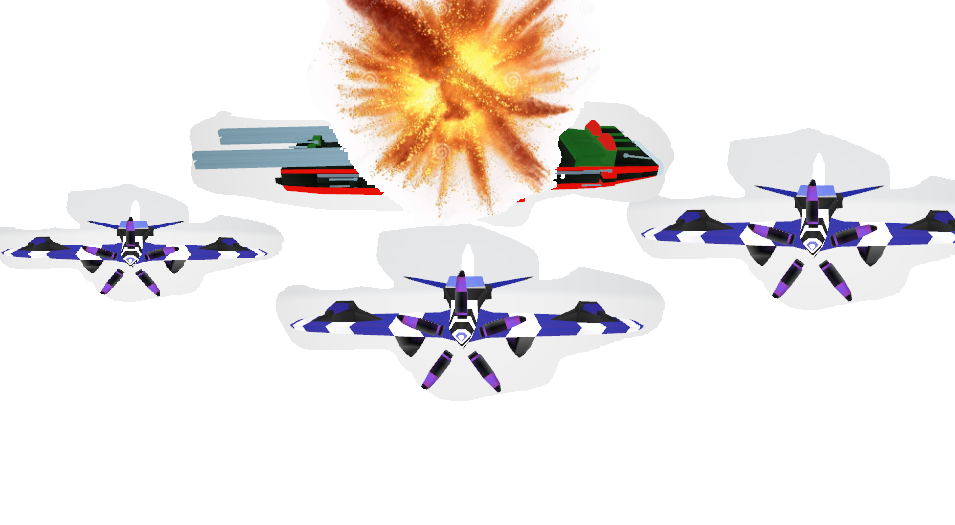

**P** : This scene caputures the ostur ships flying away from the McCannon as it explodes in the distance.

**M** : This scene uses simple path following mechanics. 

**C** : The camera is facing the ships as they fly towards it they fly past the camera exposing the full scale of the destruction.
